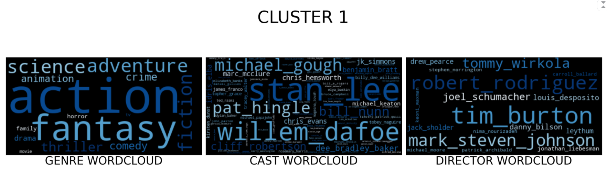
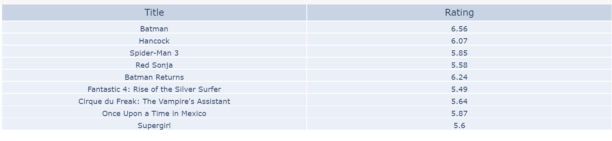
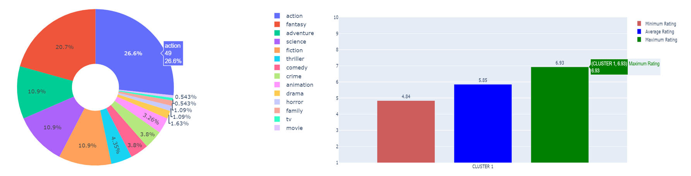
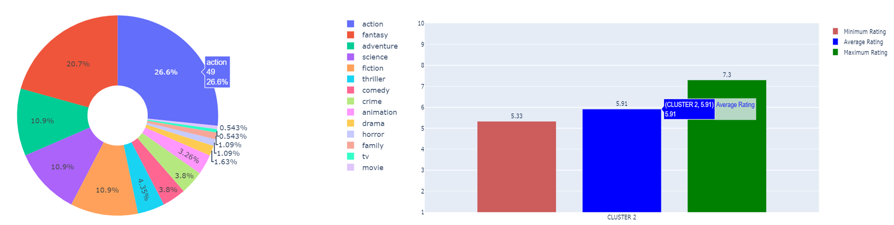
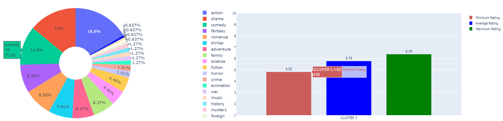

# MOVIE-RECOMMENDER-SYSTEM
A movie recommender system is used to recommend movies to users based on various factors. There are primarily two types of recommender systems, content based systems and collaborative systems. 
* Collaborative filters : This type of filter is based on users’ rates, and it will recommend us movies that we haven’t watched yet, but users similar to us have, and like. To determine whether two users are similar or not, this filter considers the movies both of them watched and how they rated them. By looking at the items in common, this type of algorithm will basically predict the rate of a movie for a user who hasn’t watched it yet, based on the similar users’ rates.

* Content-based filters : This type of filter does not involve other users if not ourselves. Based on what we like, the algorithm will simply pick items with similar content to recommend us.
## Dataset
These files contain metadata for all 45,000 movies listed in the Full MovieLens Dataset.Data points include cast, crew, plot keywords, budget, revenue, posters, release dates, languages, production companies, countries, TMDB vote counts and vote averages and ratings.

**movies_metadata.csv**: Features include title, posters, backdrops, budget, revenue, release dates, languages, production countries and companies.

**keywords.csv**: Contains the movie plot keywords for our MovieLens movies. Available in the form of a stringified JSON Object.

**credits.csv**: Consists of Cast and Crew Information for all our movies. Available in the form of a stringified JSON Object.

The goal for this NLP project was to divide the content based recommendations of a movie into separate clusters(using Kmeans clustering) and then use text analysis to determine various attributes of movies each cluster recommends. The recommender system takes movie title as an input and returns three different bags of movies. Initial sorting and subsequent clustering is done based on similarity scores (genre, cast, overview, keywords, director) and ratings of the movies. Visualization was done using wordclouds and plotly charts. Following are the recommendations for "The Chronicles of Narnia: Prince Caspian".
## Approach
We wanted to use a machine learning approach and so we decided to use clustering. A machine learning approach has three steps:
1.Data Cleaning
2.Data Preprocessing
3. Modelling

