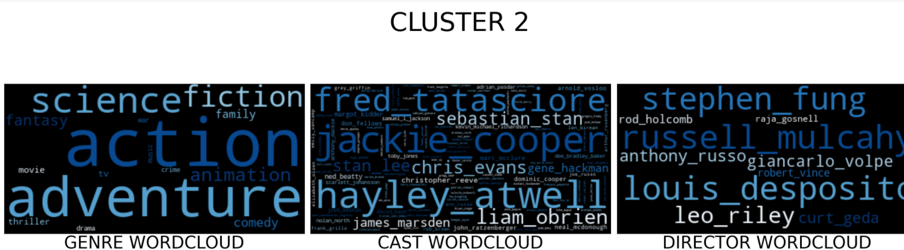
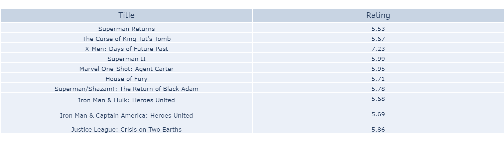
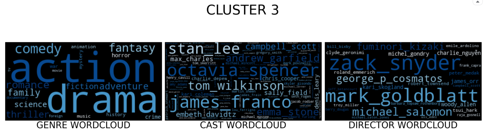
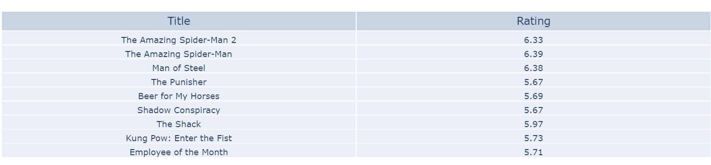

# MOVIE-RECOMMENDER-SYSTEM
A movie recommender system is used to recommend movies to users based on various factors. There are primarily two types of recommender systems, content based systems and collaborative systems. 
## Dataset:
The dataset was taken from kaggle you can find it [here](https://www.kaggle.com/rounakbanik/the-movies-dataset). The link for our kaggle notebook is [here](https://www.kaggle.com/aadarsh168/movie-recommender). These files contain metadata for all 45,000 movies listed in the Full MovieLens Dataset. Data points include cast, crew, plot keywords, budget, revenue, posters, release dates, languages, production companies, countries, TMDB vote counts and vote averages and ratings.

**movies_metadata.csv**: Features include title, posters, backdrops, budget, revenue, release dates, languages, production countries and companies.

**keywords.csv**: Contains the movie plot keywords for our MovieLens movies. Available in the form of a stringified JSON Object.

**credits.csv**: Consists of Cast and Crew Information for all our movies. Available in the form of a stringified JSON Object.

## Approach
A general approach towards a content basd sytem is that it computes similarity between movies based on certain metrics and suggests movies that are most similar to a particular movie that a user liked. On the other hand collaborative methods for recommender systems are methods that are based solely on the past interactions recorded between users and items in order to produce new recommendations. We wanted to do something different and apply a machine learning approach to the system and so we decided to use clustering. The goal for this NLP project was to divide the similarity score based recommendations of a movie into separate clusters(using Kmeans clustering) and then use text analysis to determine various attributes of movies each cluster recommends. The recommender system takes movie title as an input and returns three different bags of movies. So the process like any other ML project involved three steps :
1. Data Cleaning : The very first task was to clean the data so that it would make sense. This included managing null values, dealing with stringified JSON object data, sorting data jumbled across various columns, converting data types of columns for appropriate use.
1. Data Preprocessing : In order to perform further operations on our text, we needed to transform our documents into vector representations such that we can apply numeric machine learning. For vectorization of text corpuses "CountVectorizer" and "Tfidfvectorizer" were used. The vectorized matrix was further used as an input for calculating similarity score between movies. The output for the same was in the form of matrix. The matrix had all the movies for it's rows as well as columns, each cell representing a similarity score between the movies that belonged to the respective row and column.
1. Modelling : The similariy scores were calculated for:
      1. Overview and taglines: Idenitfy pattern of the storyline
      1. Genre and Keywords: Identifying movies of the same category.
      1. Cast: Identifying sequels and/or prequels.
      1. Director: Captures inclination towards a certain direction style. 

The above mentioned matrix was used as an input for the clustering algorithm which divided the movies into three clusters. To further analyse the similarity between movies in the similar cluster visual aid was used. Following are the plots for movie "Spider Man". Wordcloud and plotly were used for visualization.

    
   
    
   
   
    
   
   

## Future scope
Tfidfvectorizer and CountVectorizer capture the textual meaning of the data. Today algorithms like BERT and Elmo are present which capture the contextual meaning as well, which would certainly enhance the quality of the recommendations.
